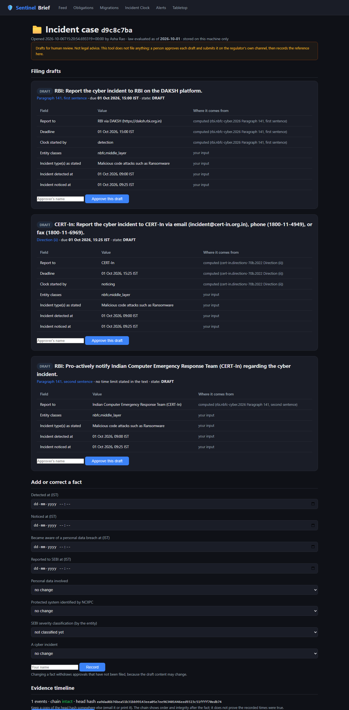
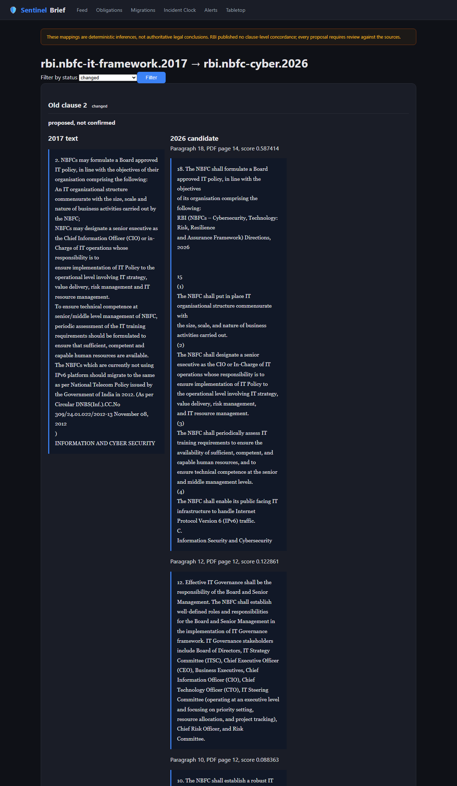
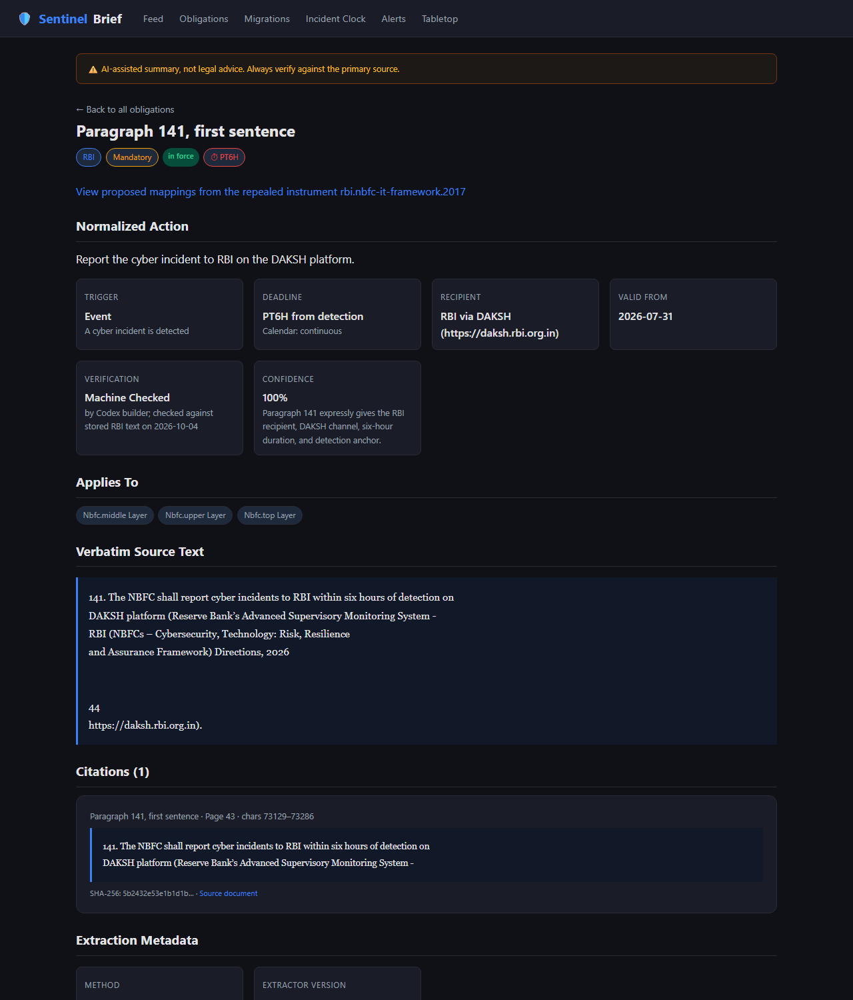
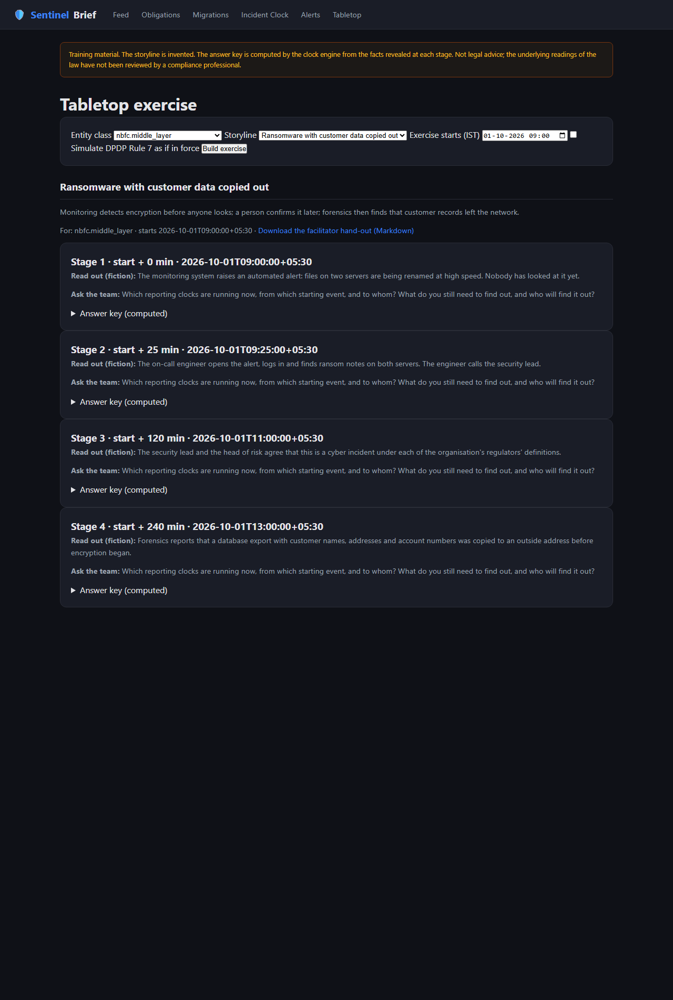

# SentinelBrief

**What Indian cyber law requires after an incident: which regulator, by when, under which clause.**

A deterministic engine over a clause-level, citation-first dataset of Indian cyber-security reporting obligations (CERT-In, RBI, SEBI, IRDAI and the DPDP Rules). Give it who you are and what happened; it returns every clock that is running, the clause behind each one, and the questions it needs answered before it will commit to an answer.

> Not legal advice. Not affiliated with any regulator. The expected answers in the benchmark were written by AI from the primary texts and have **not** been reviewed by a compliance professional, so this project quotes no accuracy figure for the law itself. See [Honest status](#honest-status).

## What it does

- **Incident clock.** One incident, every applicable deadline. A Middle Layer NBFC that is also a Data Fiduciary gets three clocks from three different starting events: RBI (six hours from *detection*), CERT-In (six hours from *noticing*), and the Data Protection Board (72 hours from *becoming aware*).
- **Asks, does not guess.** If the answer depends on a fact it does not have (is this an Annexure I incident type? what is the NBFC's layer? has the entity classified severity?), it asks. Free text can never conclude "not reportable"; only an explicit attestation can.
- **Law as of the incident date.** Each obligation has a validity interval. An incident on 30 July 2026 is not judged by a Direction issued on 31 July 2026.
- **Every claim is cited.** Each obligation stores the verbatim clause, the PDF page and character offsets, and the SHA-256 of the source file. A validator re-checks all of it on every run.
- **Incident workspace.** Field-level filing drafts where each field is labelled *computed*, *your input*, or *required by the clause (quoted)*; approval by a named person; a hash-chained evidence timeline; an audit bundle; a calendar export for recurring duties. It never files anything.
- **Card feed.** Short cards generated from the obligation records, with a grounding check that rejects facts not present in the cited text. Also served as RSS at `/feed.xml`.
- **Circular migrator.** RBI repealed its older cyber and IT circulars in July 2026 and published no clause-by-clause concordance. For four pairs of instruments (the 2017 NBFC IT Framework, the 2019 UCB cyber framework and the 2023 IT Governance Master Direction against their 2026 successors) the migrator proposes, for each old clause, which paragraph of the 2026 Direction replaced it and whether the duty changed (for example "may" became "shall"). It is deterministic, uses no language model, labels every mapping "proposed, not confirmed" until a named person confirms it, and is browsable at `/migrations`.
- **Signed evidence.** The timeline's head hash can be signed with Ed25519; the verifier says NOT TRUSTED unless you supply the public key you expect.
- **Alert intake.** A SIEM can push alerts to an HMAC-signed webhook. An alert never starts a clock or opens a case; a named person does.
- **Tabletop exercises.** Three scripted incidents for rehearsals. The storyline is fiction; the answer key at each stage is computed by the engine from what the story has revealed so far.
- **Simulation.** DPDP Rule 7 does not bind until 13 May 2027. You can ask the clock to show what it would require, and everything simulated is marked as not in force.

## What it looks like

| | |
|---|---|
|  |  |
| An incident case: two regulators, two clocks from two starting events, every field labelled with where it came from. | The migrator: a 2017 "may" beside the 2026 "shall" that replaced it. |
|  |  |
| An obligation with its verbatim clause, page and source hash. | A tabletop exercise whose answer key is computed by the engine. |

Regenerate with `uv run python scripts/capture_screenshots.py`.

## Coverage

| Regulator | Instrument | Obligations |
|---|---|---|
| CERT-In | Directions under s.70B(6), 28 April 2022 | 7 |
| MeitY | DPDP Rules 2025, Rule 7 (breach intimation) | 3 |
| SEBI | CSCRF circular, 20 August 2024 | 11 |
| RBI | Cybersecurity Directions, 31 July 2026: NBFCs (11), Urban Co-operative Banks (4), All India Financial Institutions (4), Payments Banks (4) | 23 |
| IRDAI | Information and Cyber Security Guidelines, 2023 (incident reporting and the duties found with a stated period or time limit) | 34 |

78 obligations in all. Not covered: RBI Directions for commercial banks and small finance banks; IRDAI duties stated only as "periodically"; the remaining paragraphs of the RBI Directions. `docs/OPEN_QUESTIONS.md` lists every known gap.

## How correctness is checked

- **454 tests**, including **mutation tests**: each deliberately breaks one legal rule in the engine and asserts which named scenarios then fail.
- **107 dev scenarios**, each carrying the clause quotes it relies on, verified mechanically against the stored page text. All pass.
- **Labels before code.** For RBI, SEBI and IRDAI the expected outcomes were written and committed before the implementation (`docs/LABELS_*.md`; the commit history shows the order).
- **Hidden split written by the other party.** 30 scenarios the implementer of each part never saw while building it. They are kept out of this repository so they stay hidden. Current result: **29/30** (Wilson 95% interval 83.3% to 99.4%). The one failure is a recorded disagreement between two reviewers about a contested start date, not a defect either side concedes.
- **Migrator measured against mappings written first.** 47 gold mappings were committed before the migrator existed. It puts the right paragraph first for **46/47** clauses (Wilson 95% interval 88.9% to 99.6%) and gets the status right for 38/47. On three further pairs, scored once against gold written beforehand with no threshold changed, it puts the right paragraph first for 59/61 UCB controls, and the right *section* first for 27/27 clauses of the 2023 Master Direction on each of two successors. The section-level gold is easier: the independent reviewer found the top candidate was the single best paragraph in 5 of 10 sampled clauses (Review 16). Review found that seven of the nine status disagreements were mistakes in the gold labels, not in the method (the 2026 text had turned "may" into "shall"); the gold file was left as committed and both counts are in `docs/REVIEW_LOG.md`, Review 15, with an ablation of every tuned choice.
- **Provenance controls.** Source PDFs are pinned by SHA-256, re-downloaded from the regulators and compared (`scripts/reverify_sources.py`), and guarded by gates that reject generated, truncated or undocumented files. `tests/test_provenance_attacks.py` records which attacks the gates stop and which one they do not.
- **Independent review.** Each piece of work was reviewed by a different agent than the one that built it; findings and fixes are in `docs/REVIEW_LOG.md`, including the ones that went against the author.

Run everything:

```bash
uv sync
uv run python scripts/check.py
```

## Honest status

- **Labels are AI-authored.** `benchmark/REVIEW_PACKET.md` is the packet for a compliance professional; it lists the contested readings first. Until someone qualified has gone through it, the numbers above measure *consistency with the authors' reading of the law*, not legal accuracy.
- **Contested readings are flagged, not hidden.** Where it is disputed whether a duty was binding on a given date (SEBI before April 2025, IRDAI before April 2024), the tool shows the duty on the earlier reading with a "Contested" warning. All such readings are in `docs/DECISIONS.md` with quotes, pages and the reading that was rejected.
- **Five sources cannot be re-verified automatically.** RBI's document server serves a CAPTCHA and IRDAI's robots.txt forbids automated access, so those PDFs were downloaded by a person. The RBI files were cross-checked against RBI's public web pages; the IRDAI file has no independent check yet.
- **The workspace has no login.** It is a single-user, local tool. Do not expose it on a network.
- **Built with AI coding agents under human direction.** The process (one agent builds, another reviews, labels first, hidden split by the non-author) is part of the project; an early checkpoint in which an agent fabricated source documents, and the controls added afterwards, are documented in `docs/REVIEW_LOG.md` and `docs/process/`.

## Quick start

Requires Python 3.13 and [`uv`](https://docs.astral.sh/uv/).

```bash
uv sync
uv run uvicorn sentinelbrief.api.app:app --port 8000
```

Open http://localhost:8000 . On the incident page, "Open case" (with your name) creates a case with filing drafts and an evidence timeline. Cases are plain files under `var/cases/` on your machine (git-ignored; set `SENTINELBRIEF_CASES_DIR` to move them). Nothing is sent anywhere.

From the command line:

```bash
uv run python scripts/probe.py nbfc.middle_layer,dpdp.data_fiduciary date=2027-06-01 detected=09:00 noticed=10:00 aware=11:00 personal=true
```

Useful endpoints:

- `POST /api/incident/clock` computes clocks without storing anything.
- `POST /api/cases`, `GET /api/cases/<id>`, `POST /api/cases/<id>/facts`, `.../drafts/<obligation>/approve`, `.../drafts/<obligation>/filed`, `GET /api/cases/<id>/export.zip`.
- `GET /api/calendar.ics?classes=nbfc.middle_layer&last_done=2026-10-01` exports recurring duties. Duties that depend on something the tool cannot evaluate are listed in a notice inside the calendar instead of being given a date; `audit_completed=YYYY-MM-DD` dates an insurer's audit report.
- `GET /api/tabletop?classes=nbfc.middle_layer&scenario=ransomware-with-personal-data&start=2026-10-01T09:00:00%2B05:30` builds a tabletop exercise (`/tabletop` for the page, `/api/tabletop.md` for a hand-out).
- `POST /api/intake/alert` receives a monitoring alert. Off unless `SENTINELBRIEF_WEBHOOK_SECRET` (32 characters or more) is set; the sender signs the body with HMAC-SHA256 in `X-SentinelBrief-Signature: sha256=<hex>`. Review alerts at `/intake`.
- Signing: `uv run python -m sentinelbrief.evidence keygen --out signing.key`, set `SENTINELBRIEF_SIGNING_KEY_FILE` to that file, then `uv run python -m sentinelbrief.evidence verify <bundle> --public-key <hex>`.

## Repository layout

- `data/raw/` primary source PDFs, extracted text with page offsets, and `manifest.json` (URL, SHA-256, how each file was acquired).
- `data/instruments/`, `data/obligations/`, `data/entities/`, `data/reference/` the dataset.
- `schema/` JSON Schemas for every record type.
- `src/sentinelbrief/clock/` the deterministic engine. `workspace/` cases, drafts, calendar. `verify/` validators. `cards/` the feed. `ingest/`, `extract/` fetching and PDF text extraction.
- `src/sentinelbrief/migrator/` the circular migrator; `data/migrations/` its proposals and human confirmations.
- `benchmark/scenarios/` the dev split; `benchmark/runner/scorer.py`; `benchmark/migrator_gold.json` and `benchmark/runner/migrator_scorer.py`; `benchmark/REVIEW_PACKET.md`.
- `tests/` unit, mutation and attack tests.
- `docs/DECISIONS.md` every modelling decision with its alternative; `docs/OPEN_QUESTIONS.md`; `docs/REVIEW_LOG.md` all reviews; `docs/LABELS_*.md` label specifications; `docs/process/` the build briefs.

## Verification commands

```bash
uv run python scripts/check.py                               # all gates
uv run python -m sentinelbrief.verify.validate_all           # schemas, citations, provenance
uv run python benchmark/runner/scorer.py --split dev         # benchmark
uv run python scripts/reverify_sources.py                    # re-download sources and compare (network)
uv run python scripts/make_review_packet.py                  # regenerate the reviewer packet
uv run python -m sentinelbrief.migrator build                # rebuild the 2017 to 2026 mapping proposals
uv run python -m sentinelbrief.migrator score                # score them against the gold mappings
```

## License

MIT. The regulator documents in `data/raw/` are public documents of their issuers and are included as evidence; their inclusion implies no endorsement.
